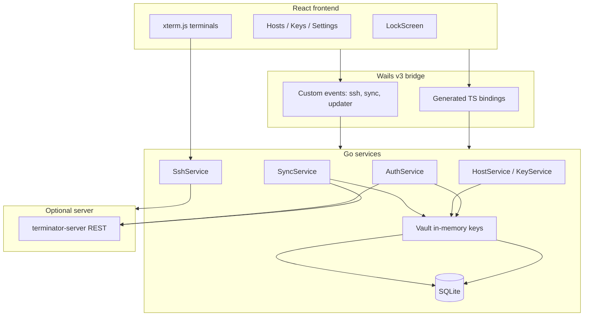

# Elemento Nexus — Architecture & Structure

Elemento Nexus is a **local-first, cross-platform SSH client** with optional **end-to-end encrypted sync** to a self-hosted [terminator-server](https://github.com/terminator-ssh/terminator-server). Sensitive data is encrypted on the client before it is stored locally or sent to the server.

The app is a **Wails v3** desktop application: a **Go backend** (SSH, crypto, database, sync) and a **React + TypeScript** UI embedded in a native webview.

---

## Tech stack

| Layer | Technologies |
|--------|----------------|
| Desktop shell | [Wails v3](https://v3.wails.io/) (`github.com/wailsapp/wails/v3`) |
| Backend | Go 1.25, SQLite (`mattn/go-sqlite3`), sqlc, golang-migrate |
| Crypto | Argon2id + AES-256-GCM (`golang.org/x/crypto`) |
| SSH | `golang.org/x/crypto/ssh` |
| Frontend | React 19, Vite 8, TypeScript, Tailwind 4, shadcn/Radix |
| Terminal UI | xterm.js (`@xterm/xterm`) |
| State / data | Zustand (UI/session/auth), TanStack Query (hosts/keys/user) |
| i18n | i18next (en, ru, de, fr, it) |
| Updates | Velopack (`velopack-go`) + GitHub releases |
| Packaging | Task (Taskfile), per-OS tasks under `build/` |

---

## Repository layout

```
terminator-desktop/
├── backend/
│   ├── cmd/terminator-desktop/     # Entry point, window, event emitters
│   ├── internal/
│   │   ├── api/                    # HTTP client → sync server
│   │   ├── apperror/               # Typed errors for frontend
│   │   ├── crypto/                 # Argon2id, AES-GCM pack/unpack
│   │   ├── dbgen/                  # sqlc-generated SQLite queries
│   │   ├── migration/              # DB migrations
│   │   ├── services/               # auth, sync, ssh, blob, settings, updater
│   │   └── vault/                  # In-memory master/login keys
│   └── db/queries/                 # SQL for sqlc
├── frontend/
│   ├── src/                        # React app
│   ├── bindings/                   # Auto-generated TS from Go (wails3 generate bindings)
│   └── public/locales/             # i18n JSON
├── build/                          # darwin / linux / windows packaging
├── embed.go                        # Embeds frontend/dist into Go binary
├── Taskfile.yml                    # dev, build, package
└── .github/workflows/release.yaml  # Tag builds for all platforms
```

---

## Architecture



### Process bootstrap

`backend/cmd/terminator-desktop/main.go` on startup:

1. Runs **Velopack** auto-update hook.
2. Resolves **app data directory** (user config in production, sibling directory in development).
3. Creates a **frameless** Wails window (custom title bar).
4. Opens **SQLite**, runs migrations, creates **Vault** and **API client**.
5. Registers **Wails services** exposed to the frontend.
6. Serves production assets from `frontend/dist` via `embed.go`.

Registered services:

| Service | Responsibility |
|---------|----------------|
| `AuthService` | User registration, login, vault lock, server registration |
| `SyncService` | Background sync with terminator-server |
| `SshService` | SSH connections and terminal I/O |
| `HostService` | Encrypted host CRUD |
| `KeyService` | Encrypted SSH key CRUD |
| `SettingsService` | App settings (e.g. language) on disk |
| `UpdaterService` | Application updates via Velopack |
| `WindowControls` | Minimize, maximize, close (frameless window) |

### Frontend ↔ backend contract

- **Methods**: Go service structs are bound to TypeScript; wrappers live under `frontend/bindings/`.
- **Events**: Registered in `main.go` `init()` (sync status, SSH I/O, updater progress). The UI subscribes via `@wailsio/runtime` `Events.On` and `AppEvent` in `frontend/src/lib/events.ts`.
- **Vite**: `@wailsio/runtime/plugins/vite` points at `./bindings` so development and production stay aligned.

Regenerate bindings after changing Go service APIs:

```sh
wails3 generate bindings -ts -d frontend/bindings ./backend/...
```

---

## Development workflow

### Prerequisites

- Go 1.25+
- Node.js 24+
- pnpm (preferred)
- [Wails3 CLI](https://v3.wails.io/getting-started/installation/)

### Common commands

| Command | Purpose |
|---------|---------|
| `wails3 dev` or `task dev` | Hot reload: rebuild Go, Vite on port 9245, run app |
| `dlv debug --headless --listen=:2345 ./backend/cmd/terminator-desktop -- dev` | Remote debug with Delve |
| `wails3 task package` | Production package for current OS |

`build/config.yml` drives dev mode: watch `.go` files, run `wails3 build DEV=true`, frontend `pnpm run dev`, then run the binary.

### Debug vs production

Build tags in `backend/cmd/terminator-desktop/env/`:

| Build | File | Behavior |
|-------|------|----------|
| Development | `dev.go` (`!production`) | `IsDebug = true`, logs to stdout + file, DB = `dev.db` next to binary |
| Production | `prod.go` | Config under user config dir, `terminator.db` |

---

## Security and data model

### Cryptography

- **KEK** (key-encryption key): Argon2id from user password + `key_salt`.
- **Login key**: separate Argon2id derivation from `auth_salt` (server authentication without sending the password).
- **Master key**: random 32 bytes, encrypted with KEK, stored in SQLite.
- **Blobs** (hosts/keys): JSON → encrypt with master key → AES-GCM blob in `encrypted_blobs`.

Argon2 parameters are fixed in `backend/internal/crypto/crypto.go` for cross-platform parity (including a future Android client).

### Vault

After login, `masterKey` and `loginKey` live in a mutex-protected in-memory **Vault** (`backend/internal/vault/vault.go`). Locking clears key material. Blob reads/writes and sync authentication require an unlocked vault.

### SQLite schema

**`users`**

| Column | Purpose |
|--------|---------|
| `username` | Local username |
| `key_salt`, `auth_salt` | Argon2 salts |
| `encrypted_master_key` | Master key wrapped with KEK |
| `server_url` | Optional sync server |
| `last_sync_time` | Incremental sync cursor |

**`encrypted_blobs`**

| Column | Purpose |
|--------|---------|
| `blob` | Opaque encrypted payload |
| `updated_at` | Change timestamp |
| `is_deleted` | Soft delete for sync |

### Auth flows (`AuthService`)

| Flow | Description |
|------|-------------|
| **Local register** | Random master key, salts, encrypt master key, store user, unlock vault |
| **Login** | Derive KEK, decrypt master key, unlock vault |
| **Login from sync** | Preflight + login against server, recreate local user row, set API token |
| **Register on server** | Push salts/encrypted master/login key, set server URL |
| **Lock / wipe** | Clear vault (+ token); wipe deletes blobs and users |

The **LockScreen** (`frontend/src/components/views/LockScreen.tsx`) drives these flows and starts `SyncService.StartAutoSync()` after cloud login.

---

## Feature implementation

### Hosts and SSH keys

- Typed models in `backend/internal/services/blob/models.go` (`Host`, `SavedKey` with `type: "host" | "key"`).
- `HostService` / `KeyService` encrypt/decrypt via shared helpers in `store.go`.
- Frontend: `useHosts` / `useKeys` (TanStack Query) call `HostService` / `KeyService`.

### SSH sessions

**Backend** (`backend/internal/services/ssh/ssh.go`):

- One map of active sessions per connection ID.
- `Connect`: dial with password or parsed private key; PTY `xterm-256color`.
- Stdout batched and emitted as base64 `ssh:data` events (~60 emits/sec cap).
- `Input`, `Resize`, `Disconnect` per session.

**Frontend** (`frontend/src/components/terminal/TerminalInstance.tsx`):

- xterm.js + FitAddon.
- `SshService.Connect(config)` on mount; listens for `ssh:data` / `ssh:closed`.
- Stdin and resize forwarded to Go.

**Session state** (`frontend/src/store/sessionStore.ts`): tab list, active session, view switching.

> **Note:** Host key verification currently uses `InsecureIgnoreHostKey()` (marked TODO in source).

### Sync

- Default interval: **3 seconds** after unlock (`backend/internal/services/sync/loop.go`).
- Pushes local blob changes since `last_sync_time` to server `POST /sync`, merges remote blobs, updates sync timestamp.
- Emits `sync:updates-available` → React Query invalidates hosts/keys.
- HTTP 401 → `unauthenticated` status, API token cleared.

### Settings and UI shell

- **Settings**: JSON file in app directory (language); not encrypted.
- **UI**: frameless window + `WindowControls`; `TitleBar`, `Sidebar`, view routing via `uiStore`.
- **Updater**: after unlock, periodic check against GitHub releases; Velopack in `main` for install-on-startup.

### Errors

Go services return structured `apperror` codes (`backend/internal/apperror/`). The frontend uses `parseAppError` / `handleAppError` for toasts and terminal messages.

---

## Frontend structure

```
main.tsx → QueryClientProvider → App
  ├── LockScreen (if !isUnlocked)
  └── TitleBar + Sidebar + ContentView
        ├── HostsPage / KeysPage / SettingsPage
        └── TerminalStack (when ViewType.Terminal)
```

### State split

| Store / layer | Responsibility |
|---------------|----------------|
| `authStore` | Unlocked / hasUser (no secrets) |
| `sessionStore` | Open SSH tabs |
| `uiStore` | Active view, update banner |
| `syncStore` | Sync status from events |
| TanStack Query | Hosts, keys, current user |

### Custom events (`frontend/src/lib/events.ts`)

| Event | Purpose |
|-------|---------|
| `sync:status` | Sync state changes |
| `sync:updates-available` | Remote data changed |
| `sync:error` | Sync failure |
| `ssh:data` | Terminal output (base64) |
| `ssh:closed` | Session ended |
| `updater:progress` | Download progress |

---

## Build and release

1. **Frontend**: `pnpm run build` → `frontend/dist`.
2. **Bindings**: `wails3 generate bindings` from Go services.
3. **Go binary**: Wails build embeds `dist` via `embed.go`.
4. **Platform tasks** (`build/darwin`, `build/linux`, `build/windows`): AppImage, nfpm, NSIS/MSIX, macOS pkg, etc.
5. **CI**: push tag `v*` → matrix build → Velopack pack/upload (Windows) and platform artifacts (Linux/macOS).

`task build:server` and Docker targets in the Taskfile are Wails template placeholders; there is no `//go:build server` implementation in this repository yet—the desktop binary is the primary deliverable.

---

## Design principles

1. **Local-first** — Full value without a server; sync is optional.
2. **E2E encryption** — The server only sees opaque blobs; the master key never leaves the client decrypted.
3. **Thin UI, thick backend** — SSH and crypto stay in Go; React handles presentation and xterm.
4. **Generated bridge** — Run binding generation when changing Go service APIs.
5. **Single-user SQLite** — One user row today; multi-profile/teams are on the [roadmap](README.md#roadmap).

---

## Related repositories

- [terminator-server](https://github.com/terminator-ssh/terminator-server) — Self-hosted sync API
- [README.md](README.md) — Features, screenshots, quick start
